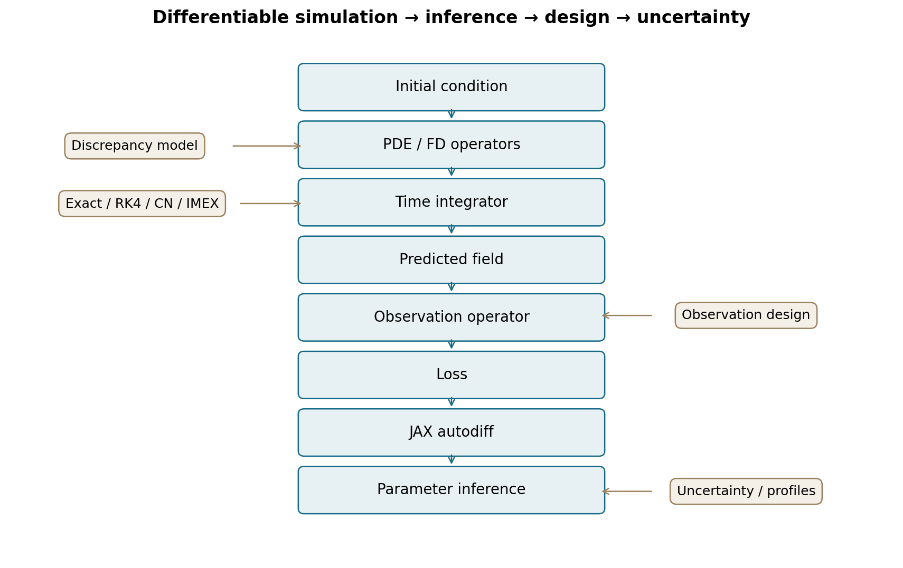

# Differentiable PDE Simulation, Inverse Modeling, and Robust Experimental Design with JAX

A validated end-to-end study of differentiable numerical simulation, physical parameter inference, discretization bias, model discrepancy, identifiability, observation design, uncertainty, and scalable integration. Eleven connected scientific stages investigate a synthetic periodic advection–hyperdiffusion problem; the final synthesis makes their evidence reproducible.

## Why this matters

A differentiable solver can converge to the wrong physical parameters. This project separates optimizer accuracy, numerical bias, observation quality and identifiability rather than judging inference only by field fit.

## Model and architecture

**∂ₜψ = −v∂ₓψ − ν₄∂ₓ⁴ψ**, on periodic x∈[0,2π), with ν₄>0 and a known initial condition.



## Key findings

- Matched synthetic data recover the diffusion coefficient to numerical precision.
- Known-velocity continuum diffusion bias falls from **18.22% at N32 to 4.85% at N48** under refinement.
- Severe scalar observations yield **44.16% parameter error despite 2.51% field error**.
- Robust weighted design reduces worst-family mean diffusion error from **38.07% to 17.53%** for the eight-sensor protocol.
- Fixed discrepancy corrections reduce bias; free corrections introduce compensation and bound-dependent uncertainty.
- Exact semi-discrete propagation confirms that earlier bias was spatial/model driven, rather than an RK4 time artifact.

All values, definitions and archived sources appear in the [key-results table](docs/final_key_results.md) and [technical report](docs/final_project_report.md). These are protocol-specific findings, not universal performance claims.

## Repository structure

```text
src/          validated numerical and inference components
experiments/  historical stage drivers and final artifact generators
examples/     small runnable demonstration
tests/        numerical, derivative and inference validation
docs/         immutable stage archives and final synthesis
figures/      ten final figures, each in SVG and PNG
```

## Quick start

```sh
python3 -m venv .venv
.venv/bin/python -m pip install -r requirements.txt
.venv/bin/python -m examples.quickstart
```

The example creates a periodic field, propagates the semi-discrete model exactly, samples matched observations, and evaluates an NMSE gradient. It does not launch an inverse study.

## Reproduce core validations and figures

```sh
.venv/bin/python -m pytest -q
.venv/bin/python -m experiments.final_figures
```

Final test result: **124 passed in 35.22s**. [Test matrix](docs/test_matrix.md).
See the [reproduction guide](docs/reproduction.md) before running historical drivers: some overwrite outputs, and Stages 8/10 are heavy. [Stage index](docs/stage_index.md).

## Final figures

[Figure gallery and captions](docs/final_project_report.md) · [Exact data provenance](docs/final_figure_provenance.md) · [SVG/PNG files](figures/)

## Limitations

This is a 1D linear periodic constant-coefficient model with synthetic Gaussian observations and a known initial condition. Exact Fourier propagation is a special-case method. Design and robustness claims are limited to declared pools/scenarios; profile coverage has finite sample sizes, and M5 calibration uncertainty is excluded. No real dataset or generic nonlinear scalability is established. [Full limitations](docs/final_project_report.md).

## Documentation

[Final report](docs/final_project_report.md) · [Benchmarks](docs/benchmark_summary.md) · [Consistency audit](docs/final_consistency_audit.md) · [Interview summary](docs/interview_project_summary.md) · [Release preparation](docs/release_summary.md)

Release: [**v1.0**](https://github.com/liyingerya/jax-differentiable-pde/releases/tag/v1.0). Archived preparation documents retain their original `v1.0-ready` status.
