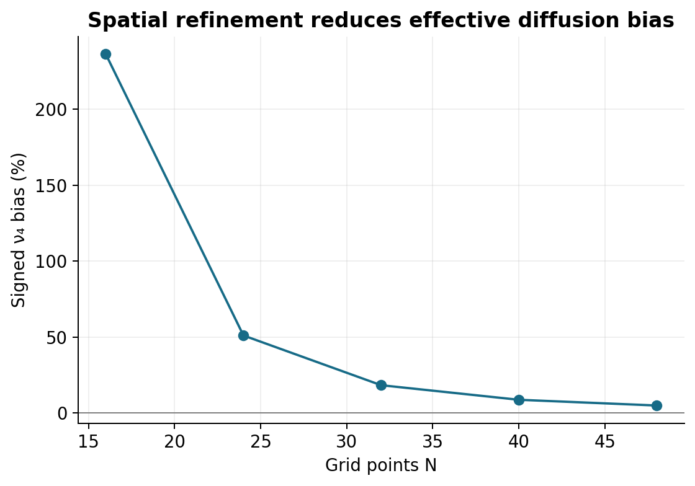
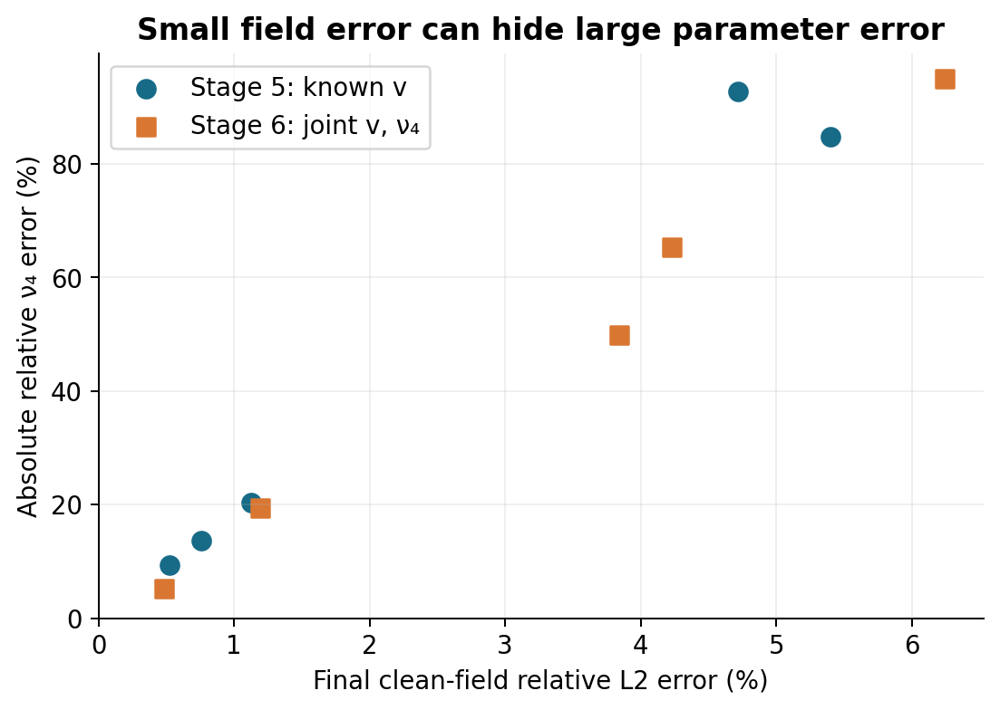
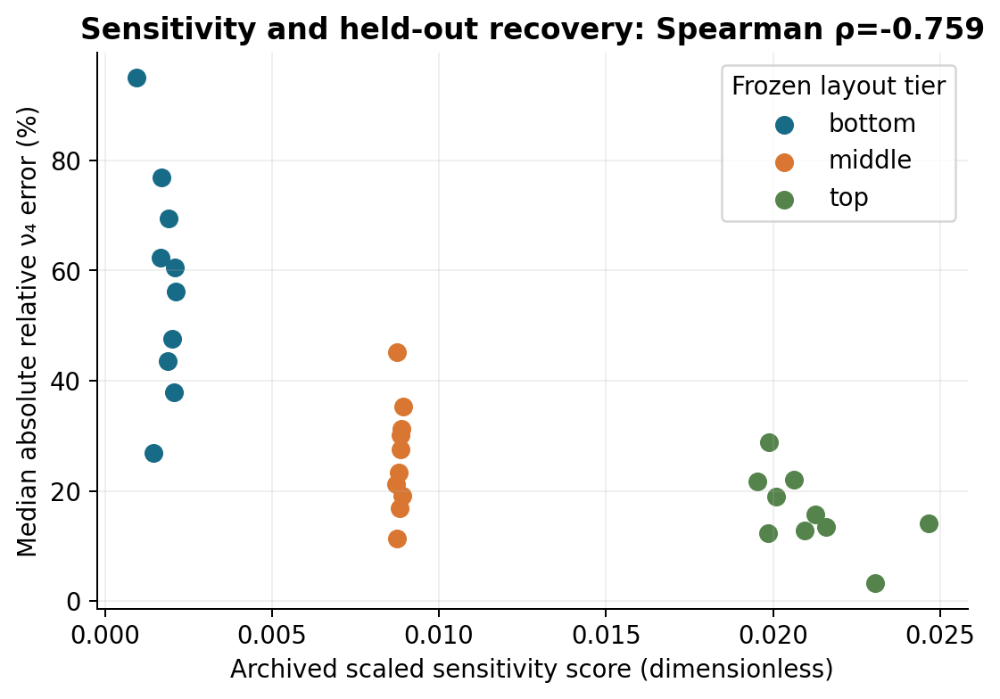
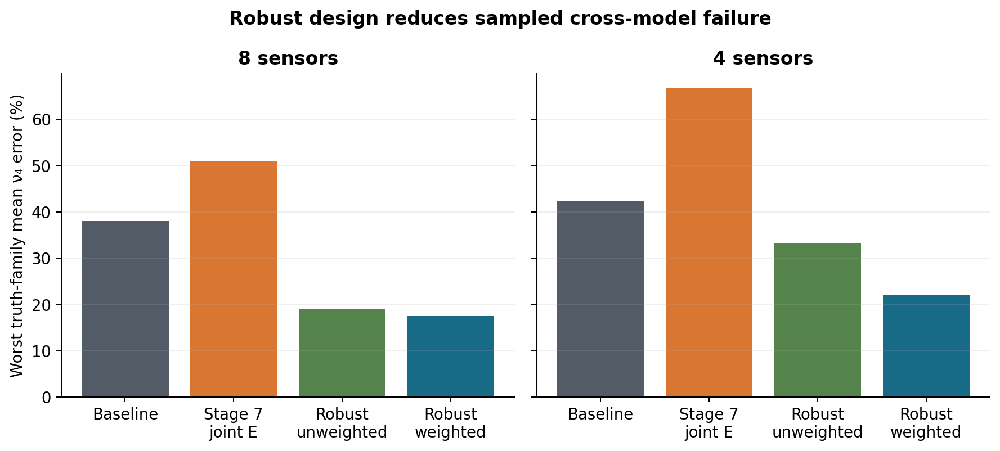
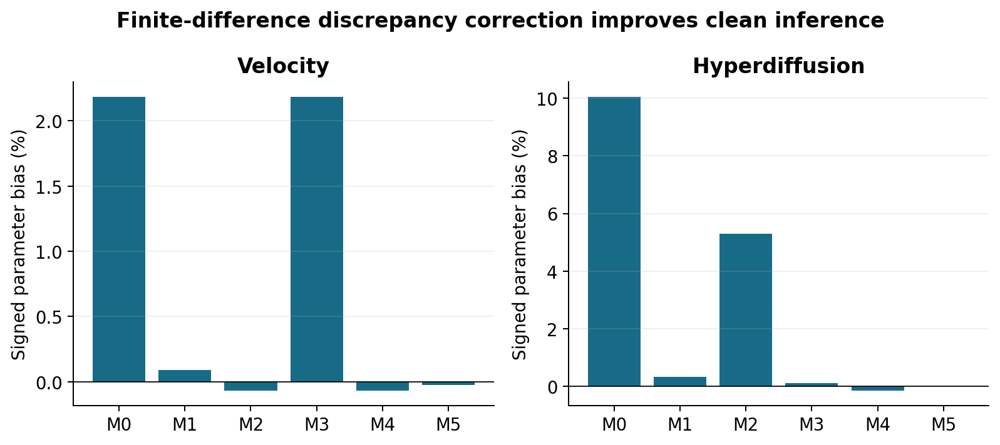
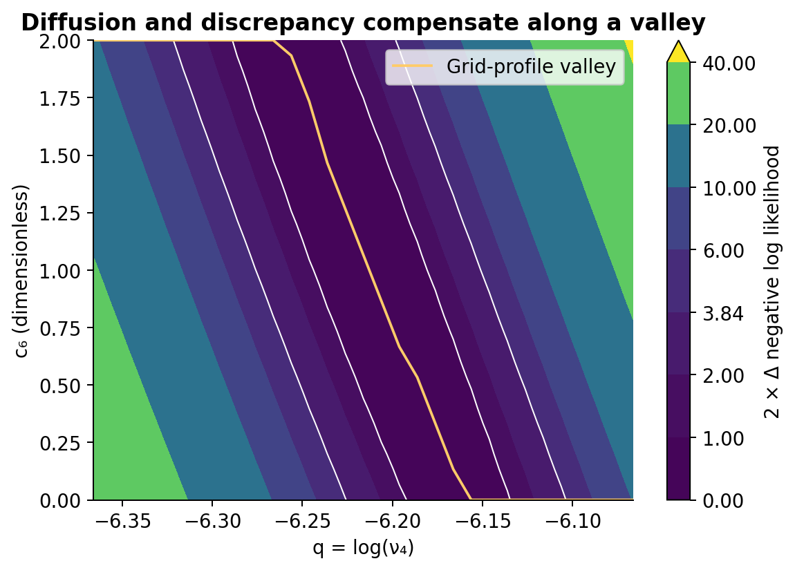
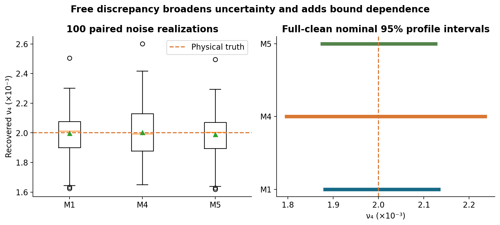
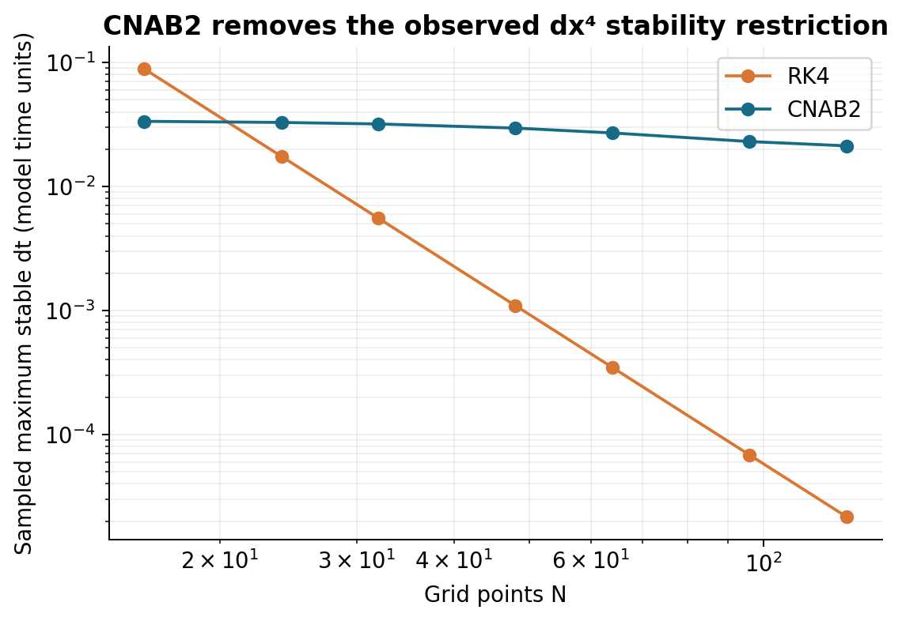
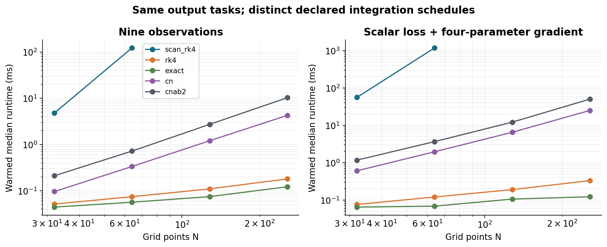

# Differentiable PDE Simulation, Inverse Modeling, and Robust Experimental Design with JAX

A validated end-to-end study of differentiable numerical simulation, physical parameter inference, discretization bias, model discrepancy, identifiability, observation design, uncertainty, and scalable integration.

## Abstract

This project develops a validated JAX workflow for differentiable simulation and inverse modeling of a periodic advection–hyperdiffusion equation. Centered finite differences and differentiable Runge–Kutta integration first establish forward accuracy and matched-data coefficient recovery. Continuum-generated observations then expose a central limitation: a converged numerical inverse problem can identify an effective discretized coefficient rather than the physical parameter. Spatial refinement, noisy and sparse observations, and joint velocity–diffusion inference separate discretization bias from weak sensitivity and stochastic error. Sensitivity-aware observation design improves matched-model recovery but can deteriorate under model mismatch, motivating a robust design across a declared ensemble. Modified-equation discrepancy corrections remove much of the clean continuum bias, while freely fitted corrections create compensation directions and bound-dependent uncertainty. Profile likelihood and paired repeated-noise ensembles complement local Hessian diagnostics without assuming that quadratic uncertainty is always too narrow. Finally, exact semi-discrete Fourier propagation verifies that the earlier parameter-bias findings were not Runge–Kutta temporal artifacts. Differentiable Crank–Nicolson and IMEX CNAB2 are evaluated for stability, accuracy, gradients and computational cost. The resulting repository connects numerical verification to inference diagnostics and reproducible evidence. Its conclusions apply to the tested synthetic, one-dimensional linear setting; they do not establish general nonlinear scalability or validation against real measurements.

## Motivation

Forward accuracy and optimizer convergence answer different questions from physical identifiability. This project starts with verified numerical differentiation, then follows failures that emerge when a differentiable solver is used to infer physics. It is a synthetic scientific-computing study, not production software or a neural PDE solver. The [stage index](stage_index.md) records the complete progression.

## Governing PDE

On x∈[0,2π) with periodic boundaries, ∂ₜψ = −v∂ₓψ − ν₄∂ₓ⁴ψ, with positive ν₄. The main initial field is sin(x)+0.5sin(2x)+0.25cos(3x). Velocity transports phase while hyperdiffusion damps short wavelengths. Later experiments use declared alternative fields and parameter points; they are not pooled with the nominal case.

## Numerical model

Centered periodic D₁ and D₄ stencils approximate the spatial derivatives. Stages [1](stage1_validation.md) and [2](stage2_validation.md) verify derivatives, Fourier-mode evolution and differentiability. The discrete symbols differ from continuum ik and k⁴. This difference remains even when time integration is exact.

## Differentiable simulation

JAX float64 computations differentiate through stencil/lax.scan RK4. Later direct Fourier propagation exploits the same linear periodic operator. Classical RK4-power evaluates its stability polynomial at integer step counts, while the Stage 11 exponential evolves the semi-discrete operator without time steps. These are separate numerical rules, not interchangeable definitions of exact continuum physics.

## Inverse parameter estimation

Synthetic observations are sampled in space and time. Earlier stages minimize normalized mean-square error; ν₄ is represented by q=log ν₄ and bounded projected Adam supplies reproducible updates. Later continuation policies preserve optimizer state and settings. Stage 10 uses positive-time Gaussian likelihood for profile inference while retaining the archived normalized stationarity criterion. Matched scalar data recover ν₄=.002 to floating-point precision, but this validates numerical consistency only. [Stage 3 report](stage3_validation.md).

## Numerical discretization bias

Continuum data fitted by a coarse FD model produce an effective coefficient. With velocity known, the N32 diffusion bias is +18.2154%, falling to +4.8490% at N48. The archived timestep controls leave this bias essentially unchanged. These scalar results must not be confused with Stage 9 joint velocity–diffusion estimates. A converged optimizer has accurately solved a biased numerical inverse problem. See [Stage 4](stage4_validation.md) and Figure 2.

## Observation robustness and identifiability

The severe scalar study has 44.16% mean diffusion error despite 2.51% mean clean-field error. Joint fitting adds a weak diffusion direction: the clean Hessian condition number is 1903.85 in (v,q). Under the severe joint protocol, mean velocity error is 0.569%, versus 46.935% for diffusion. Small state errors therefore do not establish accurate coefficient inference. These are finite synthetic ensembles, not universal error rates. See [Stage 5](stage5_validation.md), [Stage 6](stage6_validation.md), and Figure 3.

## Observation design

Scaled sensitivity scores guide finite-pool sensor/time selection. For eight sensors, matched mean diffusion error falls from 11.95% to 5.80%. Across frozen held-out layouts, the hardened score/error Spearman association is −.7593. One Stage 7 fit originally failed stationarity at 2000 updates; uniform same-state continuation resolved it without changing designs, seeds or conclusions. Better matched-model design did not guarantee transfer: the original continuum comparison worsened from about 14.38% to 32.47%. See [Stage 7](stage7_validation.md) and Figure 4.

## Robust design under model uncertainty

Stage 8 evaluates a declared multi-model, multi-field ensemble and freezes maximin designs before recovery. Worst truth-family mean diffusion error for eight sensors is 38.07% for baseline, 51.08% for Stage 7 joint E, and 17.53% for robust weighted design. Four-sensor values are 42.24%, 66.65%, and 22.03%. This reduces sampled cross-model failure rather than proving universal robustness or global continuous design optimality. See [Stage 8](stage8_validation.md) and Figure 5.

## Explicit model discrepancy

The corrected FD generator adds c₃v dx²D₃/6+c₆ν₄ dx²D₆/6. M0 has no correction; M1 fixes both coefficients to one; M2/M3 fit one correction; M4 fits both; M5 fixes coefficients from separate known-physics calibration. Joint full-clean continuum diffusion error falls from 10.0608% for M0 to .3129% for M1 and .0071% for M5. This is numerical-analysis-informed correction, not a neural model. M4 reduces residuals but its Hessian has condition number 1.44×10⁷ and normalized q–c₆ coupling .972809. More flexibility can exchange physical and discrepancy parameters. See [Stage 9](stage9_validation.md) and Figures 6–7.

## Practical uncertainty and profile inference

Stage 10 profiles nuisance coordinates, distinguishes physical truth from each model/design pseudo-truth, and uses paired repeated-noise ensembles. Full-clean nominal 95% diffusion profile widths are .000250928, .000438541 and .000250197 for M1/M4/M5. These use a hypothetical measurement-precision scale; they are not confidence statements for noiseless data. Moderate diffusion SDs are .000145679, .000178268 and .000145148. Fixed correction changes bias without a large conditional variance increase, but calibration uncertainty is excluded. M4 hits a discrepancy bound in 86% of moderate fits. The unconstrained Hessian can give wider intervals than constrained profiles; it is incorrect to claim quadratic uncertainty is always too small. Finite coverage samples and bound dependence limit certainty. See [Stage 10](stage10_validation.md) and Figures 7–8.

## Scalable time integration

Exact exponential propagation is preferred for this special linear periodic constant-coefficient system. It removes time error while retaining spatial/model bias. Stage 11 shifts clean Stage 9 parameters by at most 2.27×10⁻¹² when replacing RK4-power by the exact exponential. Sampled dtmax scaling is dx⁴ for RK4 and dx^0.23 for CNAB2 across the tested grids; no expected IMEX exponent was imposed. CN is A-stable, not L-stable. CNAB2 is a transferable semilinear stepping structure, with explicit phase restrictions and imperfect stiff damping. Timing comparisons retain the already-fast FFT RK4-power evaluator and distinguish compilation from synchronized warm calls. See [Stage 11](stage11_validation.md), [benchmark summary](benchmark_summary.md), and Figures 9–10.

## Main results

| Result | Verified finding | Archive |
| --- | --- | --- |
| Matched scalar recovery | ν₄ true/recovered = .002 / .002 | [Stage 3](stage3_validation.md) / [JSON](stage3_results.json) |
| Continuum refinement, known v | ν₄ bias: +18.2154% (N32) → +4.8490% (N48) | [Stage 4](stage4_validation.md) / [JSON](stage4_results.json) |
| Severe scalar sparse/noisy failure | Mean ν₄ error 44.16%; field error 2.51% | [Stage 5](stage5_validation.md) / [JSON](stage5_results.json) |
| Joint clean Hessian | Condition number 1903.85 in (v, log ν₄); weak diffusion direction | [Stage 6](stage6_validation.md) / [JSON](stage6_results.json) |
| Matched eight-sensor design | Mean ν₄ error 11.95% → 5.80%; frozen held-out seeds | [Stage 7](stage7_validation.md) / [JSON](stage7_results.json) |
| Worst-family diffusion error, 8 sensors | Baseline / joint E / robust weighted: 38.07% / 51.08% / 17.53% | [Stage 8](stage8_validation.md) / [JSON](stage8_results.json) |
| Worst-family diffusion error, 4 sensors | Baseline / joint E / robust weighted: 42.24% / 66.65% / 22.03% | [Stage 8](stage8_validation.md) / [JSON](stage8_results.json) |
| Joint clean continuum discrepancy | Absolute ν₄ error M0 / M1 / M5: 10.0608% / 0.3129% / 0.0071% | [Stage 9](stage9_validation.md) / [JSON](stage9_results.json) |
| Free discrepancy compensation | M4 Hessian condition 1.44e7; normalized q–c₆ coupling .972809 | [Stage 9](stage9_validation.md) / [JSON](stage9_results.json) |
| Full-clean nominal 95% profile width | M1 / M4 / M5: .000250928 / .000438541 / .000250197 | [Stage 10](stage10_validation.md) / [JSON](stage10_results.json) |
| Moderate paired-noise diffusion SD | M1 / M4 / M5: .000145679 / .000178268 / .000145148 | [Stage 10](stage10_validation.md) / [JSON](stage10_results.json) |
| M4 discrepancy-bound contact | 86% of 100 moderate repeated-noise fits | [Stage 10](stage10_validation.md) / [JSON](stage10_results.json) |
| Timestep stability scaling | dtmax ∝ dxᵖ: RK4 p=4.00, CNAB2 p=.23 | [Stage 11](stage11_validation.md) / [JSON](stage11_results.json) |
| RK4 temporal contribution to clean fits | Largest absolute coordinate shift: 2.27e−12; spatial/model bias dominates | [Stage 11](stage11_validation.md) / [JSON](stage11_results.json) |

## Final figures

**Figure 1.** Architecture: validated operators feed differentiable time integration and inverse loss; design, discrepancy and uncertainty are connected analyses. See [exact provenance](final_figure_provenance.md).

**Figure 2.** Known velocity, continuum A, zero noise; each archived fit uses its declared stability-safe RK4 schedule. See [exact provenance](final_figure_provenance.md).

**Figure 3.** Severe matched sparse/noisy conditions; field and coefficient errors are distinct metrics. See [exact provenance](final_figure_provenance.md).

**Figure 4.** Thirty frozen top/middle/bottom layouts; negative rank association is descriptive, not causal proof. See [exact provenance](final_figure_provenance.md).

**Figure 5.** Eight sensors use 2% noise; four use 5%. Robustness is limited to declared truth families and finite candidate pools. See [exact provenance](final_figure_provenance.md).

**Figure 6.** Full clean continuum A observations. M0 uncorrected; M1 theory; M2/M3 one free correction; M4 both free; M5 fixed calibrated correction. See [exact provenance](final_figure_provenance.md).

**Figure 7.** Full-clean M4 surface profiled over v,c₃, using the archived hypothetical 2%-RMS precision. Finite local domain; contour levels are diagnostics, not joint coverage claims. See [exact provenance](final_figure_provenance.md).

**Figure 8.** Left: eight sensors, 2% noise, 100 paired seeds; right: full-clean hypothetical precision, not zero-noise confidence. Different observation protocols must not be conflated. M4 has 86% discrepancy-bound contact in the left ensemble. See [exact provenance](final_figure_provenance.md).

**Figure 9.** 625 parameter tuples and ≥2049 angles per grid; fitted dt-vs-dx exponents 4.00 and 0.23. Sampling is not proof over the continuous box. See [exact provenance](final_figure_provenance.md).

**Figure 10.** Ten synchronized warmed repetitions. CN is iterative; RK4-power and exact use direct Fourier propagation. Schedules differ in accuracy. Missing fine-grid scan measurements exceed the predeclared cap; lines do not extrapolate. See [exact provenance](final_figure_provenance.md).

## Limitations

The model is one-dimensional, periodic, linear and constant coefficient. Observations are synthetic; no real experimental dataset validates physical inference. The initial condition is known exactly and noise uses simplified Gaussian models. The discrepancy basis is derived from this particular finite-difference scheme. M5 calibration uncertainty is not propagated. Exact exponential propagation relies on Fourier diagonalizability and does not establish generic nonlinear PDE scalability. Observation-design optimality is confined to finite candidate pools; robustness is only over the declared scenarios. Profile and coverage studies have finite Monte Carlo sample sizes, and nominal likelihood thresholds are not guaranteed finite-sample coverage. Discrepancy bounds affect uncertainty. Timings depend on hardware, JAX version, output requirements and compilation state.

## Lessons learned

Differentiability supplies derivatives; it does not establish identifiability. Accurate optimization can return biased effective physics. State prediction and parameter identification need separate diagnostics. Observation design can improve inference while overfitting an assumed forward model. Extra discrepancy flexibility can lower residuals while broadening uncertainty. Numerical-analysis priors can improve inference, but their calibration assumptions remain part of the uncertainty budget. Exact time integration cannot remove spatial or model bias.

## Reproduction

The [reproduction guide](reproduction.md) separates a quick demo/test/figure path from heavy historical studies. The final validation is **124 passed in 35.22s**. No expensive Stage 8 or Stage 10 study was rerun for synthesis. Figures use archived JSON only; [provenance](final_figure_provenance.md), [consistency audit](final_consistency_audit.md) and [test matrix](test_matrix.md) document checks. Historical files remain immutable.

## Future work

Prioritized extensions are: (1) a 2D PDE, (2) semilinear/nonlinear dynamics using IMEX, (3) uncertain initial-condition inference, (4) richer regularized discrepancy models, (5) neural-operator or surrogate hybridization, and (6) real observational data. None is implemented here.

## Conclusion

The main contribution is a connected validation workflow: verified derivatives enable inverse fitting; biased inference motivates refinement and discrepancy; weak sensitivity motivates design; model mismatch motivates robust design; compensation motivates profile uncertainty; stiff integration motivates exact and IMEX propagation. Each conclusion remains conditional on the declared model, data and numerical protocol. [Release preparation](release_summary.md) uses the provisional label v1.0-ready, not a Git tag.
